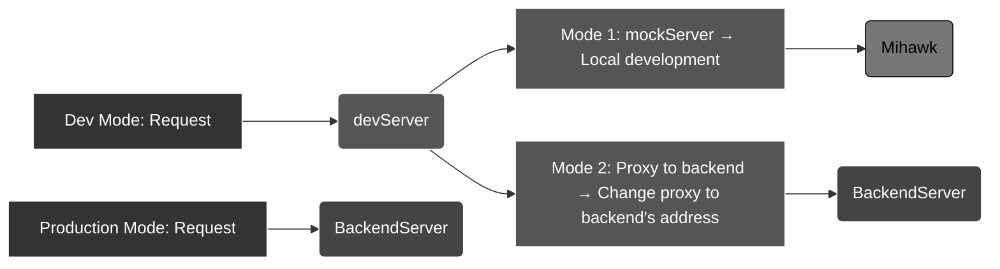

# Mihawk (simple tiny mock-server)

[](https://www.npmjs.com/package/mihawk)
[](https://www.npmjs.com/package/mihawk)
[](https://github.com/Froguard/mihawk/issues?q=is%3Aopen+is%3Aissue)
[](https://github.com/Froguard/mihawk/blob/master/LICENSE)

<!-- [](https://www.npmjs.com/package/mihawk) -->

> 🇨🇳 中文版说明 → [README.zh-CN.md](https://github.com/Froguard/mihawk/blob/master/README.zh_CN.md)

> Recommend: use version@`v1.0.0`+

Make a easy mock-server to mock api, with `GET /a/b/c` → `./mocks/data/GET/a/b/c.json` mapping

- ✔️ Zero intrusion into front-end code
- ✔️ Support https protocol
- ✔️ Support all methods, like `GET`, `POST`, `PUT`, `DELETE` etc.
- ✔️ Support mock data file type: `json` | `json5`
- ✔️ Support custom your middleware in `middleware.{js|cjs|ts}`, write as `koa2 middleware` (or `express-middleware` both ok with `func.isExpress=true`)
- ✔️ Support custom special routes mapping in `routes.json`, mapping multiple request to same resolve file。 routes key align `glob` expression
- ✔️ Support mock logic file type: `js` | `cjs` | `ts`
- ✔️ Slightly support for `socket` simulations
- ✔️ Support the generation of some simple simulation data, in `mihawk/tools`, eg: `createRandPhone`、`createRandEmail`

## Install

```sh
npm i -g mihawk
```

## Usage

```sh
mihawk --port=8888
# mihawk -p 8888
```

> then open browser and visit `http://localhost:8888`
>
> mock data directory: `./mocks/data`

```sh
./mocks
    │
    ├── /data
    │   │
    │   ├── DELETE
    │   │     ├──/*.js    DELETE request resolve logic
    │   │     └──/*.json  DELETE request resolve data
    │   │
    │   ├── GET
    │   │     ├──/*.js    GET request resolve logic
    │   │     └──/*.json  GET request resolve data
    │   │
    │   ├── POST
    │   │     ├──/*.js    POST request resolve logic
    │   │     └──/*.json  POST request resolve data
    │   │
    │   └── PUT
    │         ├──/*.js    PUT request resolve logic
    │         └──/*.json  PUt request resolve data
    │
    ├── middleware.js    [optional] resolve middleware
    │
    └── routes.json   [optional] common routes
```

> mapping：

```sh
request    ： GET http://localhost:8888/a/b/c/d
JSON-file  ： data/get/a/b/c/d.json
mock-file  :  data/get/a/b/c/d.js
```

- `request`: mock request url
- `JSON-file`: mock origin data
- `mock-file`: resolve mock logic, base on origin data

Finally, the return data will be the data after processing mock-file (the `mock-file`) with origin data (the `JSON-file`)

## Usage-Recommend ✅

> A more recommended way to use it is to write all config props into the `.mihawkrc.json` in the root directory
>
> And then run `mihawk` in you shell

### init a rc file `.mihawkrc.json`

```sh
mihawk init
```

> then edit the `.mihawkrc.json` to customize your config

```json
{
  "host": "0.0.0.0",
  "port": 8888,
  "https": false,
  "cors": true,
  "cache": true,
  "watch": true,
  "mockDir": "mocks",
  "mockDataFileType": "json",
  "mockLogicFileType": "none"
}
```

About root config props:

- `host`: string, default `0.0.0.0`, server listen on this host
- `port`: number, default `8888`, server listen on this port
- `https`: boolean, default `false`, if `true`, will use https protocol
- `cors`: boolean, default `true`, if `true`, will add `Access-Control-Allow-Origin: *` (and other necessary cors props in headers ) to the response headers
- `cache`: boolean, default `true`, if `true`, will cache the mock data and return the cached data when the request is the same
- `watch`: boolean, default `true`, if `true`, will watch the mock data directory and reload when changed
- `mockDir`: string, default `mocks`, the directory of mock data
- `mockDataFileType`: string `json` | `json5`, default `json`, the file type of mock data
- `mockLogicFileType`: string `js` | `cjs` | `ts` | `none`, default `none`, the file type of mock logic
- `setJsonByRemote`: { enable: boolean; target: string; timeout?: number; rewrite?: (path: string) => string } | null
  - Default: `undefined`
  - When local mock file not found:
    1. If set to proxy object with `{enable:true, target:'xxx' }` to fetch from remote proxy
    2. If set to `null`/`undefined` to disable
  - Proxy config requires:
    - `target`(required): remote server URL, **required**
    - `rewrite`: optional path rewrite function
    - `timeout`: request timeout in milliseconds

> More detail → [src/com-types.ts](https://github.com/Froguard/mihawk/blob/master/src/com-types.ts), interface MihawkRC define the config props

## Config with Build tools

> Essentially, it is based on the proxy functionality of `devServer`, forwarding requests to the mihawk server.

### vite

in `vite.config.js` file:

```js
import { defineConfig } from 'vite';
export default defineConfig({
  server: {
    proxy: {
      '/api': {
        target: 'http://localhost:8888', // mihawk server address
        changeOrigin: true,
        rewrite: path => path.replace(/^\/api/, ''),
      },
    },
  },
});
```

### webpack

in `webpack.config.js` file:

```js
// webpack.config.js
module.exports = {
  devServer: {
    proxy: {
      '/api': {
        target: 'http://localhost:8888', // mihawk server address
        changeOrigin: true,
        pathRewrite: { '^/api': '' },
      },
    },
  },
};
```

## Example

For request `GET /api/fetch_a_random_number`，it return response with random number data

### 1.create `mocks/data/GET/api/fetch_a_random_number.json` file, content as below

```json
{
  "code": 200,
  "data": 123456,
  "msg": "success"
}
```

> You cal aslo dont do this step, coz the mock data file is auto create when request a not exists file

Now, if request `GET /api/fetch_a_random_number`，return data is `123456`, it is fixed data

### 2.create `mocks/data/GET/api/fetch_a_random_number.js` file, content as below

```js
module.exports = async function (oldJson) {
  oldJson.data = Math.floor(Math.random() * 1000000); // generate random number
  return oldJson; // return data, it is required
};
```

Start `mihawk` server now, if request `GET /api/fetch_a_random_number`，return data is random number, each request return a different data

> About MockLogic File:
>
> - Both support `js` | `cjs` | `ts`, the process is same。Attention to `export default` is necessary in `ts` file!
> - Recommend to set `autoCreateMockLogicFile` to `true` in `.mihawkrc.json`, then, if request a not exists mock data file, it will auto create a mock logic file for you
> - Of course, it is worth mentioning that **MockLogic files aren't necessary files**. If there is no logical demand for data processing, **using only JSON files can also simulate the request**

## More example of mocks files

### `routes` file demo in ts

```ts
/**
 * mihawk's routes file:
 */
const routes: Record<string, string> = {
  'GET /test': './GET/test',
  'GET /test-*': './GET/test', // key: routePath，support glob expression; value:  mock data file path (no ext)
};
//
export default routes;
```

### `middleware` file demo in ts

```ts
/**
 * mihawk's middleware file:
 * - just a Koa2 Middleware
 */
import type { Context: KoaContext, Next: KoaNext } from 'koa'; // need koa@v2.0.0+ (eg: koa@^2.15.3)
// import type { KoaContext, KoaNext } from 'mihawk/con-types';

/**
 * Middleware functions, to implement some special data deal logic,
 * - This function exec before the default-mock-logic. Simply return or don`t call "await next()" could skip default-mock-logic
 * - This function is a standard KOA middleware that follows the KOA onion ring model
 * - see more：https://koajs.com/#middleware
 * @param {Context} ctx
 * @param {Next} next
 * @returns {Promise<void>}
 */
export default async function middleware(ctx: KoaContext, next: KoaNext) {
  // do something here
  console.log(ctx.url);
  if (ctx.peth === '/diy') {
    ctx.body = 'it is my diy logic';
  } else {
    await next(); // default logic (such like mock json logic)
  }
}
```

> Set `middleware.isExpress=true` to explicit definition a express middleware function before export, if you write in express-stype
> Other complex diy middleware demo, base on koa-router & koa-compose, [middleware.md](./docs/middleware.md)

### `mock-logic` file demo in ts

```ts
'use strict;';
/**
 * GET /xxx
 * This file isn‘t mandatory. If it is not needed (such as when there is no need to modify response data), it can be deleted directly
 */

/**
 * Mock data resolve function, the original data source is the JSON file with the same name as this file
 * @param {object} originData (mocks/data/GET/xxx.json)
 * @param {MhkCvtrExtra} extra { url,method,path,query,body }
 * @returns {object} newData
 */
export default async function convertData(originData: Record<string, any>, extra: Record<string, any>) {
  // write your logic here...
  originData.newProp = 'newPropXxx';
  return originData; // return data, it is required
}
```

## Differences from Mockjs?

### 1. Different positioning

- Mockjs is a front-end mockjs library that provides powerful simulated data generation capabilities
- Mihawk is a Node.js mock service that can be used with front-end projects or standalone; it provides mock capabilities for httpServer/SocketServer based on Nodejs



### 2. Different implementation methods

- Mockjs intercepts requests and returns simulated data by hijacking xhr/fetch, etc., which requires certain modifications to front-end engineering code, and there are some differences in the request sending/receiving process compared to the real online environment
- Mihawk intercepts requests and returns simulated data through Koa2 middleware format, without requiring any modifications to front-end engineering code, and the request sending/receiving process is identical to the real online environment

### 3. Common usage scenarios

- Mockjs is used for simulated data production, generating corresponding fake data through its specific syntax
- Mihawk is used to simulate BackendServer based on Nodejs, such as Socket, httpServer, etc., combined with simple data generation functions to complete fake data generation
  - `mhiawk/tools`: Built-in utility functions like `creatRandXxx` for generating fake data; this functionality is not as powerful as Mockjs
    - Consider using both mockjs's `data generate` and mihawk's `server mock` together; they are not mutually exclusive
  - `your_project/mocks/middleware.ts`: Simulate backend services, such as httpServer
  - `your_project/mocks/socket.ts`: Simulate backend services, such as socketServer
