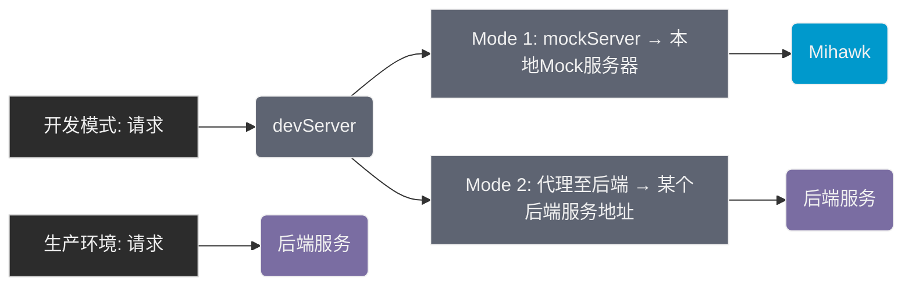

# Mihawk (简单小巧的 MockServer 工具)

[](https://www.npmjs.com/package/mihawk)
[](https://www.npmjs.com/package/mihawk)
[](https://github.com/Froguard/mihawk/issues?q=is%3Aopen+is%3Aissue)
[](https://github.com/Froguard/mihawk/blob/master/LICENSE)

<!-- [](https://www.npmjs.com/package/mihawk) -->

> 🇺🇸 English → [README.md](https://github.com/Froguard/mihawk/blob/master/README.md)

> 推荐使用版本 `v1.0.0`+

采用 `GET /a/b/c` → `./mocks/data/GET/a/b/c.json` 方式去做 api 请求的 mock server 工具

- ✅ 对于项目的前端代码零侵入
- ✅ 支持 https 协议
- ✅ 支持所有有请求方法，例如 `GET`, `POST`, `PUT`, `DELETE` 等，通过文件路径方式自动映射请求路径
- ✅ 用以定义 mock 的数据文件，同时支持 `json` | `json5` 两种格式
- ✅ 用以处理 mock 数据的逻辑文件，支持 `js` | `cjs` | `ts` 三种格式，可以对 json 请求进行二次修改，以便于支持一些动态逻辑处理
- ✅ 在默认的文件映射功能之外，允许在 `middleware.{js|cjs|ts}` 文件中，通过暴露 koa2 middleware 函数的形式，完成自定义路由的复杂的处理逻辑 (express中间件也兼容，通过设置中间件函数func.isExpress=trye即可)
- ✅ 允许自定义 `routes.json` 文件方式, 让多条路径映射到同一个文件，其中 key 允许 glob 表达式
- ✅ 简单支持 `socket` 的模拟
- ✅ 通过 `mihawk/tools` 提供一些简单的函数，便于模拟数据的生成，如: `createRandPhone`、`createRandEmail`



> 上图中 `devServer` 一般为本地开发时候的打包工具可提供，如 vite，webpack 等，均有对应配置

## 安装

```sh
npm i -g mihawk
```

## 使用

```sh
mihawk --port=8888
# mihawk -p 8888
```

> 打开网页 `http://localhost:8888`
>
> mock 文件夹: `./mocks/data`

```sh
./mocks
    │
    ├── /data
    │   │
    │   ├── DELETE
    │   │     ├──/*.js    DELETE 请求处理逻辑
    │   │     └──/*.json  DELETE 请求对应的数据
    │   │
    │   ├── GET
    │   │     ├──/*.js    GET 请求处理逻辑
    │   │     └──/*.json  GET 请求对应的数据
    │   │
    │   ├── POST
    │   │     ├──/*.js    POST 请求处理逻辑
    │   │     └──/*.json  POST 请求对应的数据
    │   │
    │   └── PUT
    │         ├──/*.js    PUT 请求处理逻辑
    │         └──/*.json  PUt 请求对应的数据
    │
    ├── middleware.js    [optional] 自定义koa2中间件，用以实现自定义逻辑
    │
    └── routes.json   [optional] 全局路由映射，用以进行路由逻辑复用（将多个路由通过glob表达式映射到相同文件）
```

> 路由与文件的映射关系

```sh
request    ： GET http://localhost:8888/a/b/c/d
JSON-file  ： data/get/a/b/c/d.json
mock-file  :  data/get/a/b/c/d.js
```

- `request`: 模拟的请求路径
- `JSON-file`: mock 用的原始 json 数据
- `mock-file`: mock 的处理逻辑文件，可以修改 json 数据，例如添加一些自定义的属性等

最终请求的返回结果，将会是经由 mock-file 处理 JSON-file 后的数据

## 推荐用法

> 比较推荐的办法是，通过在根目录下，自定义一个 `.mihawkrc.json` 文件，用来完成配置项的编写
>
> 然后运行 `mihawk` 命令

### 初始化 `.mihawkrc.json`

```sh
mihawk init
```

> 然后编辑该文件，完成配置

```json
{
  "host": "0.0.0.0",
  "port": 8888,
  "https": false,
  "cors": true,
  "cache": true,
  "watch": true,
  "mockDir": "mocks",
  "mockDataFileType": "json",
  "mockLogicFileType": "none"
}
```

关于这里边的配置项：

- `host`: string，默认值为 `0.0.0.0`，server 将监听该地址
- `port`: number, 默认值为 `8888`，server 将监听该端口
- `https`: boolean, 默认值为 `false`，如果为 `true`，则使用 https 协议
- `cors`: boolean, 默认值为 `true`，如果为 `true`，则添加 `Access-Control-Allow-Origin: *` 等等跨域相关的到响应头
- `cache`: boolean, 默认值为 `true`，如果为 `true`，则对返回的 json 数据进行缓存，下次请求相同路径时，直接返回缓存的数据
- `watch`: boolean, 默认值为 `true`，如果为 `true`，则对 mock 数据目录进行监听，文件变动时，自动重新加载。（优先级大于缓存，当检测到文件变更，会强制刷新当前缓存）
- `mockDir`: string, 默认值为 `mocks`，表示 mock 数据的目录
- `mockDataFileType`: string 可选值为 `json` | `json5` 之一, 默认值为 `json`，表示 mock 数据的文件格式
- `mockLogicFileType`: string 可选值为 `js` | `cjs` | `ts` | `none` 之一, 默认值为 `none`，表示 mock 数据的处理逻辑文件
- `setJsonByRemote`: { enable: boolean; target: string; timeout?: number; rewrite?: (path: string) => string } | null
  - 默认值: `undefined`
  - 当本地 mock 文件不存在时:
    1. 设置为包含 `{enable:true, target:'xxx' }` 的代理对象时，将从远程代理获取数据
    2. 设置为 `null`/`undefined` 时禁用该功能
  - 代理配置要求:
    - `target`(必填): 远端服务器URL，该值为必须值
    - `rewrite`: 可选路径重写函数
    - `timeout`: 请求超时时间（毫秒）

> 更多说明，详见 ts 定义文件 → [src/com-types.ts](https://github.com/Froguard/mihawk/blob/master/src/com-types.ts), interface MihawkRC 定义了所有配置项

## 在常见的打包工具中，配置 Mihawk

> 本质上就是基于 `devServer` 的代理功能，将请求转发至 `mihawk` 服务器

### vite

配置 `vite.config.js` 文件:

```js
import { defineConfig } from 'vite';
export default defineConfig({
  server: {
    proxy: {
      '/api': {
        target: 'http://localhost:8888', // mihawk server address
        changeOrigin: true,
        rewrite: path => path.replace(/^\/api/, ''),
      },
    },
  },
});
```

### webpack

配置 `webpack.config.js` 文件:

```js
// webpack.config.js
module.exports = {
  devServer: {
    proxy: {
      '/api': {
        target: 'http://localhost:8888', // mihawk server address
        changeOrigin: true,
        pathRewrite: { '^/api': '' },
      },
    },
  },
};
```

## 示例

假设有一个请求 `GET /api/fetch_a_random_number`，返回一个随机数，那么可以这样写：

### 1.创建一个 `mocks/data/GET/api/fetch_a_random_number.json` 文件，内容如下

```json
{
  "code": 200,
  "data": 123456,
  "msg": "success"
}
```

> 注意，这一步也可以不通过手动创建，当请求发过来的时候，如果文件不存在，会自动创建一个空的 json 文件，并返回给客户端，然后在这个自动创建的文件里修改即可

此时，如果请求 `GET /api/fetch_a_random_number`，返回的数据就是这个文件里的内容，即：会得到固定的 `123456` 这个数据

### 2.创建一个 `mocks/data/GET/api/fetch_a_random_number.js` 文件，内容如下

```js
module.exports = async function (oldJson) {
  oldJson.data = Math.floor(Math.random() * 1000000); // 随机生成一个 6 位的数字
  return oldJson; // 必要的返回
};
```

完成文件创建，启动 `mihawk` 服务，此时，如果请求 `GET /api/fetch_a_random_number`，返回的数据是随机的，即：每次请求，返回的数据都不一样

> 其他说明：
>
> - 关于 MockLogic 文件，除了支持 js(cjs相同) 外，还支持 `ts`, 创建 `ts` 文件一样的效果，这里不在赘述，唯一需要注意的是，需要在 ts 文件中进行 `export default` 操作
> - 推荐可以在 `.mihawkrc.json` 中，配置 `autoCreateMockLogicFile` 为 `true`，这样，当请求一个不存在的 mock 数据文件时，会自动创建一个对应的 mock logic 文件，方便后续开发
> - 当然，值得一提的时，**MockLogic 文件，并非必** 要文件，如果没有数据的处理逻辑诉求，**只使用 json 文件也是可以的**

## Mock 文件示例

### `routes` 文件 ts

```ts
/**
 * mihawk's routes file:
 */
const routes: Record<string, string> = {
  'GET /test': './GET/test',
  'GET /test-*': './GET/test', // key 为路由，支持 glob 表达式，value 为处理文件的路径（不加后缀）
};
//
export default routes;
```

### `middleware` 文件 ts 示例

```ts
/**
 * mihawk's middleware file:
 * - just a Koa2 Middleware
 */
import type { Context: KoaContext, Next: KoaNext } from 'koa'; // need koa@v2.0.0+ (eg: koa@^2.15.3)
// import type { KoaContext, KoaNext } from 'mihawk/con-types';

/**
 *  koa 中间件函数
 * - 标准的 koa2 中间件函数写法，遵循 koa 的洋葱圈模型
 * - 注意：如果想要跳过内置的 mock 逻辑，如无需走 json mock 那一套，直接 return，或者不调用 await next() 语句接口
 * - 更多文档：https://koajs.com/#middleware
 * @param {Context} ctx
 * @param {Next} next
 * @returns {Promise<void>}
 */
export default async function middleware(ctx: KoaContext, next: KoaNext) {
  console.log(ctx.url);
  if (ctx.peth === '/diy') {
    ctx.body = 'it is my diy logic';
  } else {
    await next(); // 默认的 json mock 逻辑，如果不需要，则不调用即可
  }
}
```

> 如果使用的是 express 风格的 中间件函数，需要给函数设置 `isExpress=true` 标明其是一个 express 中间件
> 其他一些稍微复杂点的 middleware demo，比如基于 koa-router 和 koa-compose, 详见 [middleware.md](./docs/middleware.md)

### `mock-logic` 文件 ts 示例

```ts
'use strict;';
/**
 * GET /xxx
 *
 */

/**
 * json 数据二次处理函数
 * @param {object} originData (mocks/data/GET/xxx.json)
 * @param {MhkCvtrExtra} extra { url,method,path,query,body }, 请求相关的基本信息字段
 * @returns {object} newData 处理后的新数据（需要显式进行 return）
 */
export default async function convertData(originData: Record<string, any>, extra: Record<string, any>) {
  // 自定义处理逻辑
  originData.newProp = 'newPropXxx';
  return originData; // 需要进行显式 return
}
```

## 和 Mockjs 区别？

### 1、定位不同

- Mockjs 是一个前端的 mockjs 库，提供了强大的模拟数据生成功能
- Mihawk 是一个 Node.js 的 mock 服务，可以和前端项目一起使用，也可以单独使用；提供了基于 Nodejs 的 httpServer|SocketServer 的 mock 能力

### 2、实现方式不同

- Mockjs 通过劫持 xhr/fetch 等，对于请求进行拦截并返回模拟数据，对于前端工程代码有一定改造，且请求与真实线上环境的收发过程有一定差异
- Mihawk 通过 Koa2 中间件的形式，对请求进行拦截并返回模拟数据，对于前端工程代码无改造，且请求与真实线上环境的收发过程无差异

### 3、常用使用场景

- Mockjs 用于模拟数据的生产，通过其提供的特定语法，生成对应的假数据
- Mihawk 用于基于 Nodejs 实现对于 BackendSenver 的模拟，比如 Socket, httpServer 等，搭配简单的数据生产函数，完成假数据的生成
  - `mhiawk/tools`: 内置的一些工具函数 `creatRandXxx` 等生成假数据，这部分功能并没有 Mockjs 那么强大;
    - 可以考虑同时使用 mockjs 的 `data generate` 和 mihawk 的 `server mock`，配合完成；两者并不冲突
  - `mocks/middleware.ts`: 模拟后端服务，比如 httpServer
  - `mocks/socket.ts`: 模拟后端服务，比如 socketServer
