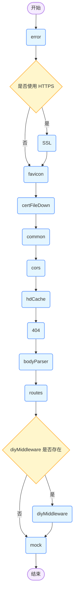

# 中间件逻辑说明

> 请使用插件 Markdown Preview Mermaid Support 查看流程图

```mermaid
graph TB
classDef startend fill:#F5EBFF,stroke:#BE8FED,stroke-width:2px;
classDef process fill:#E5F6FF,stroke:#73A6FF,stroke-width:2px;
classDef decision fill:#FFF6CC,stroke:#FFBC52,stroke-width:2px;

    A([开始]):::startend --> B(error):::process
    B --> C{是否使用 HTTPS}:::decision
    C -->|是| D(SSL):::process
    C -->|否| E(favicon):::process
    D --> E
    E --> F(certFileDown):::process
    F --> G(common):::process
    G --> H(cors):::process
    H --> I(hdCache):::process
    I --> J(404):::process
    J --> K(bodyParser):::process
    K --> L(routes):::process
    L --> M{diyMiddleware 是否存在}:::decision
    M -->|是| N(diyMiddleware):::process
    M -->|否| O(mock):::process
    N --> O
    O --> P([结束]):::startend
```
