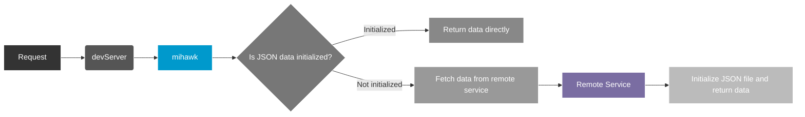

# init json data file by remote



## 1. Function Triggers

- When no local mock rule matches
- `setJsonByRemote.enable` is true in config
- `setJsonByRemote.target` was setted in config, by a valid url

## 2. Configuration Parameters

```ts
interface {
  enable: boolean;
  /** Target server URL */
  target: string;
  /** Timeout in milliseconds */
  timeout?: number;
  /** Path rewrite function */
  rewrite?: (path: string) => string;
}
```

## 3. Complete Configuration Example

```ts
// .mihawkrc.ts
export default {
  // ...
  setJsonByRemote: {
    enable: true,
    target: 'https://api.example.com',
    timeout: 5000,
    rewrite: path => path.replace(/^\/api\/, '/'),
  },
  // ...
};
```

## 4. Request Forwarding Mechanism

1. Request interception -> 2. Local matching -> 3. Proxy forwarding -> 4. Response handling -> 5. Exception catching
