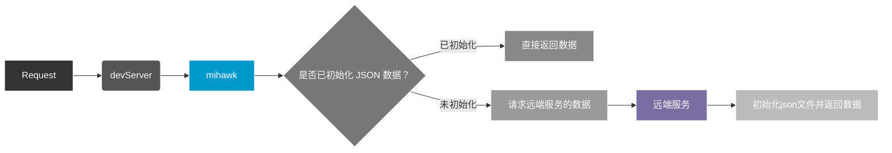

# 用远端接口初始化本地 mock 数据



## 1. 功能触发条件

- 当本地未匹配到mock规则时
- 配置文件中开启`setJsonByRemote.enable`选项
- 配置文件中正确配置了 `setJsonByRemote.target` 选项（url字符串形式）

## 2. 配置参数类型

```ts
interface {
  enable: boolean;
  /** 目标服务器URL */
  target: string;
  /** 超时时间（毫秒） */
  timeout?: number;
  /** 路径重写函数 */
  rewrite?: (path: string) => string;
}
```

## 3. 完整配置示例

```ts
// .mihawkrc.ts
export default {
  // ...
  setJsonByRemote: {
    enable: true,
    target: 'https://api.example.com',
    timeout: 5000,
    rewrite: path => path.replace(/^\/api\/v1/, '/v1'),
  },
  // ...
};
```

## 4. 请求转发机制

1. 请求拦截 -> 2. 本地匹配 -> 3. 代理转发 -> 4. 响应处理 -> 5. 异常捕获
