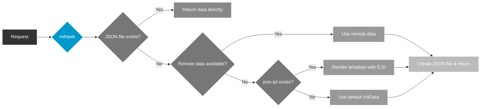

# JSON Data Template (json.tpl)

When a mock JSON data file does not exist, mihawk will automatically create it. By default, a fixed `initData` is used. You can customize the initialization content by placing a `json.tpl` file under `$mockDir/template/`.

## How It Works



## Template Location

```
$mockDir/
  template/
    json.tpl    <-- EJS template file
  data/
    ...
```

The default `$mockDir` is `./mocks` in your project root.

## Available Variables

| Variable       | Type     | Description                                                      |
| -------------- | -------- | ---------------------------------------------------------------- |
| `jsonPath`     | `string` | Relative path of the JSON file, e.g. `GET/api/user.json`         |
| `jsonPath4log` | `string` | Path used for logging, e.g. `mocks/data/GET/api/user.json`       |
| `routePath`    | `string` | Route path, e.g. `GET /api/user`                                 |
| `mockRelPath`  | `string` | Mock relative path (without extension), e.g. `GET/api/user`      |
| `method`       | `string` | HTTP method, e.g. `GET`, `POST`                                  |
| `url`          | `string` | Full request URL (including query string), e.g. `/api/user?id=1` |

## Example

Create `mocks/template/json.tpl`:

```ejs
{
  "code": 200,
  "data": {},
  "msg": "Auto init file: <%= jsonPath4log %>",
  "_meta": {
    "route": "<%= routePath %>",
    "method": "<%= method %>",
    "url": "<%= url %>"
  }
}
```

When a request for `GET /api/user` is received and `mocks/data/GET/api/user.json` does not exist, mihawk will render the template and create the JSON file with the following content:

```json
{
  "code": 200,
  "data": {},
  "msg": "Auto init file: mocks/data/GET/api/user.json",
  "_meta": {
    "route": "GET /api/user",
    "method": "GET",
    "url": "/api/user"
  }
}
```

## Fallback Priority

When the JSON file does not exist, the initialization source is determined in the following order:

1. **Remote data** — If `setJsonByRemote.enable` is `true` and the remote request succeeds
2. **Template rendering** — If `mocks/template/json.tpl` exists
3. **Default initData** — Hard-coded fallback `{ code: 200, data: 'Empty data!', msg: '...' }`

## Notes

- The template file must be valid JSON after EJS rendering, otherwise it falls back to the default `initData`
- Template rendering errors are logged as warnings but do not block the request
- The template path is resolved once at startup and cached; changes require a server restart to take effect
