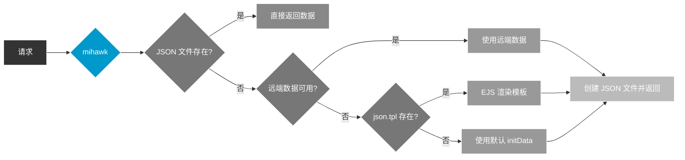

# JSON 数据模板 (json.tpl)

当 mock JSON 数据文件不存在时，mihawk 会自动创建该文件。默认情况下使用固定的 `initData`，你可以在 `$mockDir/template/` 下放置 `json.tpl` 文件来自定义初始化内容。

## 工作原理



## 模板位置

```
$mockDir/
  template/
    json.tpl    <-- EJS 模板文件
  data/
    ...
```

默认的 `$mockDir` 是项目根目录下的 `./mocks`。

## 可用变量

| 变量           | 类型     | 说明                                                    |
| -------------- | -------- | ------------------------------------------------------- |
| `jsonPath`     | `string` | JSON 文件的相对路径，例如 `GET/api/user.json`           |
| `jsonPath4log` | `string` | 用于日志输出的路径，例如 `mocks/data/GET/api/user.json` |
| `routePath`    | `string` | 路由路径，例如 `GET /api/user`                          |
| `mockRelPath`  | `string` | mock 相对路径（无后缀），例如 `GET/api/user`            |
| `method`       | `string` | HTTP 方法，例如 `GET`、`POST`                           |
| `url`          | `string` | 完整请求 URL（包含查询参数），例如 `/api/user?id=1`     |

## 示例

创建 `mocks/template/json.tpl`：

```ejs
{
  "code": 200,
  "data": {},
  "msg": "Auto init file: <%= jsonPath4log %>",
  "_meta": {
    "route": "<%= routePath %>",
    "method": "<%= method %>",
    "url": "<%= url %>"
  }
}
```

当收到 `GET /api/user` 请求且 `mocks/data/GET/api/user.json` 不存在时，mihawk 会渲染模板并创建如下内容的 JSON 文件：

```json
{
  "code": 200,
  "data": {},
  "msg": "Auto init file: mocks/data/GET/api/user.json",
  "_meta": {
    "route": "GET /api/user",
    "method": "GET",
    "url": "/api/user"
  }
}
```

## 降级优先级

当 JSON 文件不存在时，初始化来源按以下优先级确定：

1. **远端数据** — `setJsonByRemote.enable` 为 `true` 且远程请求成功时
2. **模板渲染** — `mocks/template/json.tpl` 文件存在时
3. **默认 initData** — 硬编码的兜底数据 `{ code: 200, data: 'Empty data!', msg: '...' }`

## 注意事项

- 模板经 EJS 渲染后必须是合法 JSON，否则会回退到默认 `initData`
- 模板渲染错误会以警告形式输出日志，但不会阻塞请求
- 模板路径在启动时解析并缓存，修改后需重启服务生效
